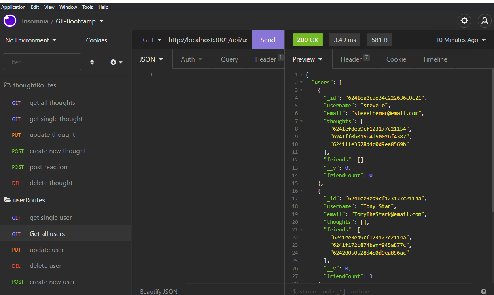

# Social Network API

## Table of Contents

1.[Description](#Description)  
2.[Link](#Link)  
3.[Installation](#Installation)  
4.[Usage](#Usage)  
5.[Tests](#Tests)  
6.[License](#License)  
7.[Credits](#Credits)  
8.[Questions](#Contacts)

## Link to repo

https://github.com/mkang987/social_network_API

## Demo Link

https://youtu.be/S1gnuiBc4YY

## Description

The application creates an API for a social network where users can post thoughts and friends can react to thoughts. It also has a feature to add friends. Utilizes MongoDB and Express

## Licenses

  
[License Information](./License.md)

## Installation

npm install

## Usage

after installation run node index.js

## Credits

N/A

## Contacts

Contact me via Email at mkang987@gmail.com
